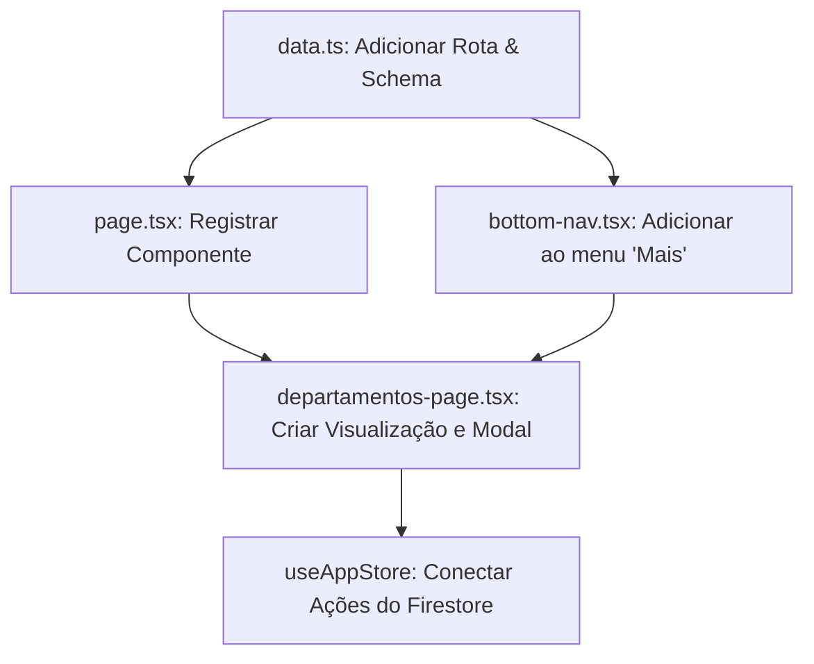

# Plano de Implementação: Aba de Departamentos

Este plano detalha as etapas necessárias para implementar a nova aba **Departamentos** no sistema APEX Porter. A aba seguirá o layout padrão do sistema, incluindo uma listagem com busca, um botão para criar/editar registros através de um modal (idêntico ao modal de *Nova Pessoa* mas com apenas os campos de **Nome** e **Empresa**), integração com a coleção `"departamentos"` no Firestore e a inclusão da rota no menu **Mais** do rodapé.

---

## 🎯 Resumo das Alterações



---

## 📂 Passos Detalhados de Implementação

### 1. Atualizar Tipagem e Schemas (`src/lib/data.ts`)

Precisamos registrar a nova aba na definição de tipos de páginas (`PageType`) e garantir que a interface `Departamento` possua o campo `empresa`, conforme solicitado.

**Alterações em [data.ts](file:///d:/APEX%20Sistemas/APEX%20Porter/src/lib/data.ts):**

*   **PageType:** Adicionar `'departamentos'` à união de páginas.
*   **Departamento:** Adicionar `empresa: string` na interface.

```typescript
// No arquivo src/lib/data.ts

export type PageType =
  | 'login'
  | 'dashboard'
  | 'fluxo'
  | 'correspondencias'
  | 'veiculos'
  | 'pre-autorizacao'
  | 'relatorios'
  | 'cadastros'
  | 'departamentos' // <-- Nova Rota
  | 'ramais'
  // ... rest

export interface Departamento {
  id: string;
  nome: string;
  empresa: string; // <-- Campo adicionado
  responsavel?: string;
}
```

---

### 2. Registrar no Navegador de Páginas (`src/app/page.tsx`)

Precisamos importar o novo componente de página e adicioná-lo ao `PageRenderer` para que o Next.js renderize a tela correta quando o estado `currentPage` for `'departamentos'`.

**Alterações em [page.tsx](file:///d:/APEX%20Sistemas/APEX%20Porter/src/app/page.tsx):**

*   Importar o componente `DepartamentosPage` de `@/components/departamentos-page`.
*   Inserir o mapeamento `'departamentos': <DepartamentosPage />` no objeto `pages`.

```typescript
// No arquivo src/app/page.tsx

import DepartamentosPage from '@/components/departamentos-page'; // <-- Importar nova página

// Dentro de PageRenderer()
const pages: Record<string, React.ReactNode> = {
  dashboard: <DashboardPage />,
  fluxo: <FluxoPage />,
  relatorios: <RelatoriosPage />,
  cadastros: <CadastrosPage />,
  departamentos: <DepartamentosPage />, // <-- Registrar rota
  ramais: <RamaisPage />,
  // ... rest
};
```

---

### 3. Adicionar o Atalho no Menu "Mais" (`src/components/bottom-nav.tsx`)

Para que o usuário possa acessar a aba Departamentos, adicionaremos o atalho na lista `SECONDARY_NAV` (que é renderizada ao clicar em "Mais" no menu inferior). Usaremos o ícone `Building2` da biblioteca `lucide-react`.

**Alterações em [bottom-nav.tsx](file:///d:/APEX%20Sistemas/APEX%20Porter/src/components/bottom-nav.tsx):**

*   Importar o ícone `Building2` do `lucide-react`.
*   Adicionar o item de menu em `SECONDARY_NAV`.

```typescript
// No arquivo src/components/bottom-nav.tsx

import {
  // ... outros ícones
  Building2, // <-- Importar o ícone
} from 'lucide-react';

const SECONDARY_NAV: NavItem[] = [
  { page: 'ocorrencias', label: 'Ocorrências', icon: AlertTriangle },
  // ...
  { page: 'departamentos', label: 'Departamentos', icon: Building2 }, // <-- Novo item no modal "Mais"
  { page: 'relatorios', label: 'Relatórios', icon: FileText },
  // ... rest
];
```

---

### 4. Criar o Componente de Tela (`src/components/departamentos-page.tsx`)

Criaremos uma nova página baseada no layout padrão do sistema (como a página de Cadastros). Ela conterá:
1.  **Cabeçalho Premium:** Título com o ícone e contador em tempo real dos departamentos.
2.  **Busca Rápida:** Campo de busca filtrando tanto por **Nome do Departamento** quanto por **Empresa**.
3.  **Botão Novo Departamento:** Aciona o modal de criação.
4.  **Listagem Dinâmica:** Cartões com design moderno exibindo o departamento, a empresa associada e botões rápidos de editar e deletar.
5.  **Modal "Novo / Editar Departamento":** Layout idêntico ao modal de *Nova Pessoa*, mas simplificado com apenas os campos **Nome** e **Empresa** (com validação de dados e alertas Toast).

**Código de Exemplo para a Nova Tela (`src/components/departamentos-page.tsx`):**

```tsx
'use client';

import { useState, useMemo } from 'react';
import { motion, AnimatePresence } from 'framer-motion';
import {
  Plus,
  Trash2,
  Search,
  Building2,
  Edit2,
  X,
  Check,
} from 'lucide-react';
import { Button } from '@/components/ui/button';
import { Input } from '@/components/ui/input';
import { Label } from '@/components/ui/label';
import { Card, CardContent } from '@/components/ui/card';
import {
  Dialog,
  DialogContent,
  DialogHeader,
  DialogTitle,
  DialogFooter,
} from '@/components/ui/dialog';
import { useAppStore } from '@/lib/store';
import { type Departamento } from '@/lib/data';
import { toast } from 'sonner';

interface FormState {
  nome: string;
  empresa: string;
}

const EMPTY_FORM: FormState = {
  nome: '',
  empresa: '',
};

export default function DepartamentosPage() {
  const { departamentos, addDepartamento, removeDepartamento, updateDepartamento } = useAppStore();

  const [dialogOpen, setDialogOpen] = useState(false);
  const [editingId, setEditingId] = useState<string | null>(null);
  const [form, setForm] = useState<FormState>({ ...EMPTY_FORM });
  const [search, setSearch] = useState('');

  // Listagem filtrada
  const filteredDepartamentos = useMemo(() => {
    let list = departamentos;
    if (search.trim()) {
      const q = search.toLowerCase();
      list = list.filter(
        (d) =>
          d.nome.toLowerCase().includes(q) ||
          d.empresa.toLowerCase().includes(q)
      );
    }
    return list;
  }, [departamentos, search]);

  const openNewDialog = () => {
    setEditingId(null);
    setForm({ ...EMPTY_FORM });
    setDialogOpen(true);
  };

  const openEditDialog = (dep: Departamento) => {
    setEditingId(dep.id);
    setForm({
      nome: dep.nome,
      empresa: dep.empresa || '',
    });
    setDialogOpen(true);
  };

  const handleSave = () => {
    if (!form.nome.trim()) {
      toast.error('O nome do departamento é obrigatório');
      return;
    }
    if (!form.empresa.trim()) {
      toast.error('A empresa associada é obrigatória');
      return;
    }

    if (editingId) {
      updateDepartamento({
        id: editingId,
        nome: form.nome.trim(),
        empresa: form.empresa.trim(),
      });
      toast.success('Departamento atualizado com sucesso!');
    } else {
      addDepartamento({
        id: `dep_${Date.now()}`,
        nome: form.nome.trim(),
        empresa: form.empresa.trim(),
      });
      toast.success('Departamento cadastrado com sucesso!');
    }

    setDialogOpen(false);
    setEditingId(null);
    setForm({ ...EMPTY_FORM });
  };

  const updateForm = (field: keyof FormState, value: string) => {
    setForm((prev) => ({ ...prev, [field]: value }));
  };

  return (
    <motion.div
      initial={{ opacity: 0 }}
      animate={{ opacity: 1 }}
      className="p-4 md:p-6 pb-24 space-y-4"
    >
      {/* Cabeçalho */}
      <div className="flex items-center justify-between">
        <div>
          <h2 className="text-xl font-bold flex items-center gap-2">
            <Building2 className="h-5 w-5 text-emerald-600" />
            Departamentos
          </h2>
          <p className="text-sm text-muted-foreground">
            {departamentos.length} departamento{departamentos.length !== 1 ? 's' : ''} cadastrado{departamentos.length !== 1 ? 's' : ''}
          </p>
        </div>
        <Button
          onClick={openNewDialog}
          size="sm"
          className="bg-emerald-600 hover:bg-emerald-700"
        >
          <Plus className="h-4 w-4 mr-1" />
          Novo Departamento
        </Button>
      </div>

      {/* Busca */}
      <div className="relative">
        <Search className="absolute left-3 top-1/2 -translate-y-1/2 h-4 w-4 text-muted-foreground" />
        <Input
          placeholder="Buscar por departamento ou empresa..."
          value={search}
          onChange={(e) => setSearch(e.target.value)}
          className="pl-9"
        />
        {search && (
          <button
            onClick={() => setSearch('')}
            className="absolute right-3 top-1/2 -translate-y-1/2 text-muted-foreground hover:text-foreground"
          >
            <X className="h-4 w-4" />
          </button>
        )}
      </div>

      {/* Lista */}
      <div className="space-y-2">
        <AnimatePresence mode="popLayout">
          {filteredDepartamentos.length === 0 && (
            <motion.div
              initial={{ opacity: 0 }}
              animate={{ opacity: 1 }}
              exit={{ opacity: 0 }}
              className="text-center py-12 text-muted-foreground"
            >
              <Building2 className="h-12 w-12 mx-auto mb-3 opacity-30" />
              <p className="text-sm">
                {search
                  ? 'Nenhum departamento encontrado para os filtros aplicados'
                  : 'Nenhum departamento cadastrado ainda'}
              </p>
              <Button
                variant="outline"
                size="sm"
                onClick={openNewDialog}
                className="mt-3"
              >
                <Plus className="h-4 w-4 mr-1" />
                Cadastrar Departamento
              </Button>
            </motion.div>
          )}

          {filteredDepartamentos.map((d) => (
            <motion.div
              key={d.id}
              layout
              initial={{ opacity: 0, y: 10 }}
              animate={{ opacity: 1, y: 0 }}
              exit={{ opacity: 0, x: -100 }}
              transition={{ duration: 0.2 }}
            >
              <Card className="overflow-hidden">
                <CardContent className="p-0">
                  <div className="flex items-stretch">
                    <div className="w-1.5 shrink-0 bg-emerald-500" />
                    <div className="flex-1 p-3 flex items-center justify-between gap-3 min-w-0">
                      <div className="min-w-0 flex-1">
                        <p className="font-medium truncate">{d.nome}</p>
                        <p className="text-xs text-muted-foreground truncate">
                          Empresa: {d.empresa}
                        </p>
                      </div>
                      <div className="flex items-center gap-1 shrink-0">
                        <Button
                          variant="ghost"
                          size="icon"
                          className="h-8 w-8 text-muted-foreground hover:text-emerald-600 hover:bg-emerald/10"
                          onClick={() => openEditDialog(d)}
                        >
                          <Edit2 className="h-4 w-4" />
                        </Button>
                        <Button
                          variant="ghost"
                          size="icon"
                          className="h-8 w-8 text-destructive hover:bg-destructive/10"
                          onClick={() => {
                            removeDepartamento(d.id);
                            toast.success('Departamento removido');
                          }}
                        >
                          <Trash2 className="h-4 w-4" />
                        </Button>
                      </div>
                    </div>
                  </div>
                </CardContent>
              </Card>
            </motion.div>
          ))}
        </AnimatePresence>
      </div>

      {/* Modal Novo/Editar Departamento (Idêntico ao Nova Pessoa) */}
      <Dialog open={dialogOpen} onOpenChange={setDialogOpen}>
        <DialogContent className="max-w-md">
          <DialogHeader>
            <DialogTitle className="flex items-center gap-2">
              {editingId ? (
                <>
                  <Edit2 className="h-5 w-5 text-emerald-600" />
                  Editar Departamento
                </>
              ) : (
                <>
                  <Building2 className="h-5 w-5 text-emerald-600" />
                  Novo Departamento
                </>
              )}
            </DialogTitle>
          </DialogHeader>

          <div className="space-y-4 py-2">
            {/* Campo Nome */}
            <div className="space-y-1.5">
              <Label className="text-xs font-medium">Nome do Departamento *</Label>
              <Input
                placeholder="Ex: Recursos Humanos, TI, Almoxarifado"
                value={form.nome}
                onChange={(e) => updateForm('nome', e.target.value)}
              />
            </div>

            {/* Campo Empresa */}
            <div className="space-y-1.5">
              <Label className="text-xs font-medium">Empresa *</Label>
              <Input
                placeholder="Ex: APEX Sistemas, Terceirizada Premium"
                value={form.empresa}
                onChange={(e) => updateForm('empresa', e.target.value)}
              />
            </div>
          </div>

          <DialogFooter className="gap-2 sm:gap-0">
            <Button variant="outline" onClick={() => setDialogOpen(false)}>
              Cancelar
            </Button>
            <Button onClick={handleSave} className="bg-emerald-600 hover:bg-emerald-700">
              {editingId ? (
                <>
                  <Check className="h-4 w-4 mr-1" />
                  Salvar Alterações
                </>
              ) : (
                <>
                  <Plus className="h-4 w-4 mr-1" />
                  Cadastrar
                </>
              )}
            </Button>
          </DialogFooter>
        </DialogContent>
      </Dialog>
    </motion.div>
  );
}
```

---

## 🔒 Integração com Firestore & Zustand (Garantida)

A integração com o Firestore já está totalmente pronta nas camadas inferiores (`src/lib/store.ts` e `src/lib/firestore-collections.ts`):

*   **Coleção:** `"departamentos"`
*   **Ações já configuradas e sincronizadas automaticamente em tempo real:**
    *   `addDepartamento(dep)`: Chama `setDepartamentoFS` enviando o payload.
    *   `updateDepartamento(dep)`: Chama `updateDepartamentoFS` atualizando campos parciais.
    *   `removeDepartamento(id)`: Chama `removeDepartamentoFS` deletando o documento.
    *   `subscribeDepartamentos`: Mantém o array local `departamentos` no Zustand sincronizado instantaneamente via ouvintes ativos da SDK do Firestore.

---

## 🛠️ Próximos Passos (Ações Recomendadas)

1.  **Aprovar o plano:** Diga se concorda com os passos e se deseja prosseguir.
2.  **Executar a criação e modificação dos arquivos:**
    *   Faremos a edição em `src/lib/data.ts` para registrar a tipagem.
    *   Faremos o registro da tela em `src/app/page.tsx`.
    *   Adicionaremos o ícone no menu secundário de `src/components/bottom-nav.tsx`.
    *   Criaremos o novo arquivo `src/components/departamentos-page.tsx` com o código proposto.
3.  **Validar a aplicação:** Compilar localmente e testar em tempo real as operações CRUD.
